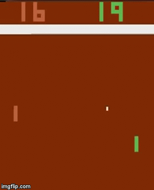
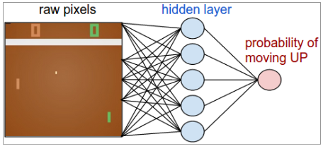
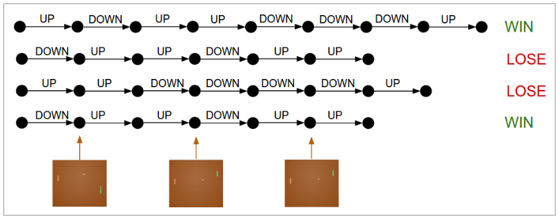
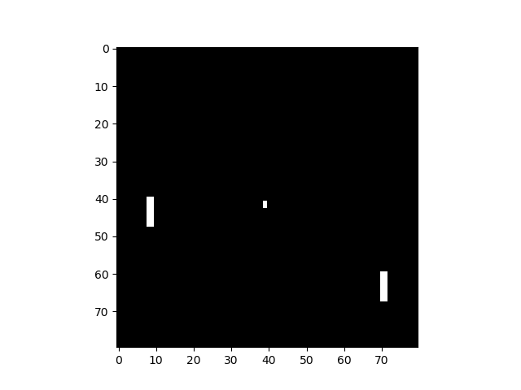

# Reinforcement-Learning-Policy-Gradients
Playing pong with reinforcement learning

The goal in Reinforcement Learning (RL) is learning how to map observations and measurements to a set of actions while trying to maximize some long-term reward. This usually involves applications where an agent interacts with an environment while trying to learn optimal sequences of decisions. As a result, RL is most suitable for sequential decision making tasks. Supervised learning hinges on labelled data. RL methods take actions in the world where the only feedback is a reward, either positive or negative. So, instead of giving labels, we establish an algorithm that will interact with the world, receive feedback and change its behaviour based on that feedback. Rl is challenging in real-world situations as the algorithm needs to learn from its experience, so it needs to be allowed make mistakes. 

  

## Policy Gradients
With the pPolicy Gradient (PG) approach, a neural network is used and initiialy produces a random action (e.g. up or down). This action is then sent back to the game. This allows the agent to explore the environment randomly at ealy stages. The agent receives a reward or penalty for its action and the objective is to maximize this reward. In a game of pong, rewards or penalties are awared at the end of a round (+1 or -1). At this early stage the agent may choose a random sequence of actions that results in a reward. We then update the policy gradients in the neural network to make these actions more likely in the future. For negative rewards/penalties we apply the negative gradient so that these actions will be slowly filtered out. 

  

An important part of PG is discounting the reward so that actions closer to when the reward was achieved are weighted more. See the Figure below. Actions earlier in the sequence are discounted so that they are weighted less and this is reflected in updating the network gradients. 

  

For preprocessing, see below, we downsamled the image and removed background color shown below as per Andrej http://karpathy.github.io/2016/05/31/rl/ 

  

